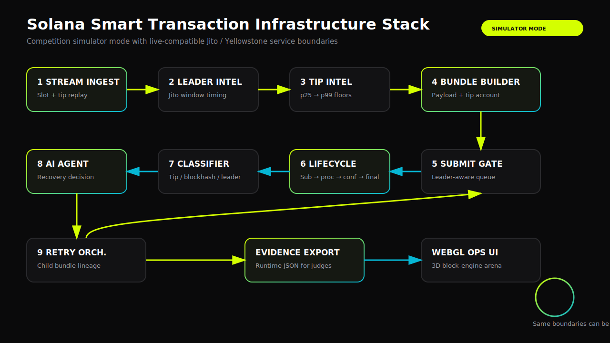
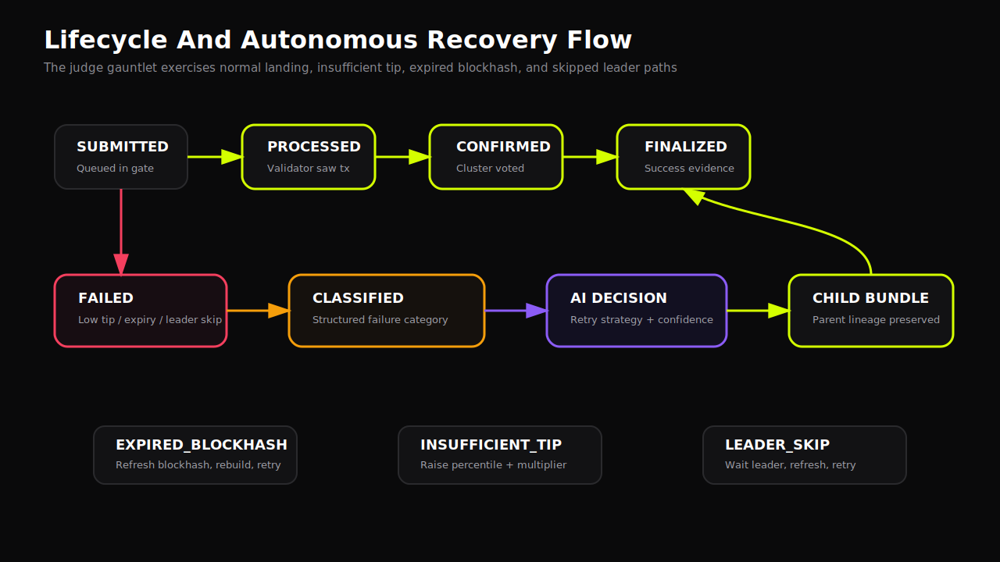
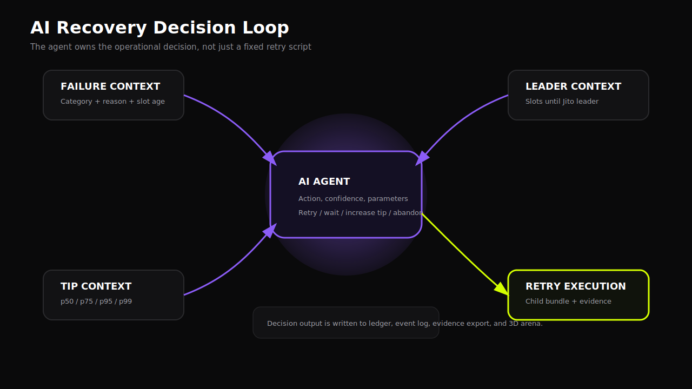

# Diagram Assets

Use these in the README, Notion page, and demo materials.

## System Architecture

File: `docs/assets/system-architecture.svg`

Use this near the top of the Notion architecture page to show the nine-service pipeline and simulator/live-compatible boundary.

## Lifecycle Recovery Flow

File: `docs/assets/lifecycle-recovery.svg`

Use this in the failure handling section to explain submitted, processed, confirmed, finalized, failed, classified, AI decision, and retry child bundle flow.

## AI Decision Loop

File: `docs/assets/ai-decision-loop.svg`

Use this in the AI agent section to show that the model/agent receives failure context, tip context, and leader context before deciding the retry strategy.
