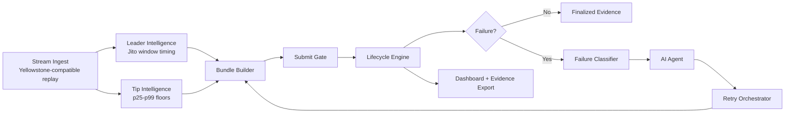
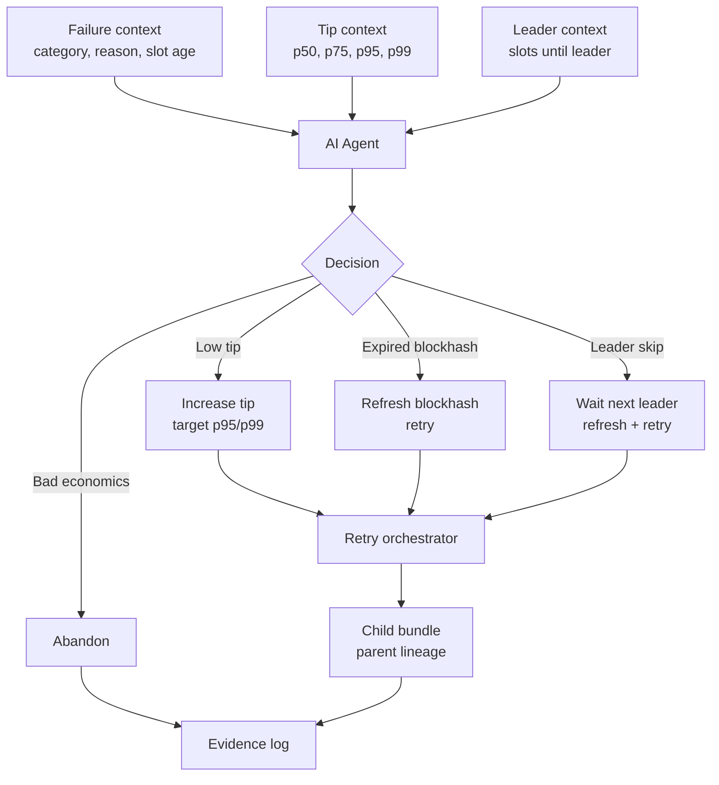

# Notion Site Copy

Copy this into your public Notion architecture page and adjust screenshots/links as needed.

---

# Solana Smart Transaction Infrastructure Stack

Public page: https://app.notion.com/p/Solana-Smart-Transaction-Infrastructure-Stack-38eec094301580e79a79d6bb645e52d9?source=copy_link

## One-Line Summary

An AI-assisted Solana transaction infrastructure simulator that demonstrates Jito-style bundle submission, Yellowstone-style streaming, lifecycle tracking, failure classification, autonomous retry decisions, and operational observability without requiring paid live infrastructure.

## Project Context

On Solana, sending a transaction is only one part of the transaction lifecycle. A reliable system also needs to understand slot timing, leader windows, blockhash age, tip competition, commitment progression, and failure recovery.

This project models that full lifecycle through a live-compatible simulator. It is built around the same service boundaries required for a production Jito/Yellowstone stack, but defaults to an offline replay mode so judges can inspect the architecture and behavior without paid infrastructure access.

## Important Submission Note

This submission runs in **Competition Simulator Mode** by default.

It does not claim explorer-verifiable mainnet bundle submissions unless live Jito/Yellowstone credentials are configured. Instead, it focuses on demonstrating:

- Correct transaction-infrastructure architecture.
- Failure handling behavior.
- Dynamic tip decision logic.
- Lifecycle tracking.
- AI-assisted retry reasoning.
- Operational dashboarding and evidence export.

## Visual Assets To Upload

Upload these images into the Notion page:

1. `docs/assets/system-architecture.svg`
   - Place under **Architecture Overview**.
2. `docs/assets/lifecycle-recovery.svg`
   - Place under **Failure Handling Strategy**.
3. `docs/assets/ai-decision-loop.svg`
   - Place under **AI Decision Responsibility**.

Suggested caption:

> These diagrams show the simulator's live-compatible service boundaries. The default demo is offline, but the data flow mirrors how the system would be wired to paid Jito and Yellowstone providers.

## Architecture Overview

The stack is divided into nine services connected by an internal event bus:

**Place image here:** `system-architecture.svg`

1. **Stream Ingest**
   - Receives slot, transaction, and tip-account events.
   - Uses Yellowstone-compatible event shapes.
   - Falls back to 400ms local slot replay in simulator mode.

2. **Leader Intelligence**
   - Tracks current slot.
   - Computes next Jito-compatible leader window.
   - Feeds submit timing and retry decisions.

3. **Tip Intelligence**
   - Maintains rolling tip observations.
   - Computes p25, p50, p75, p95, and p99 tip floors.
   - Responds to simulated congestion shifts.

4. **Bundle Builder**
   - Builds Jito-style bundle payloads.
   - Chooses tip accounts.
   - Tracks blockhash slot age.

5. **Submit Gate**
   - Queues bundles for the next viable leader window.
   - Uses simulated block-engine submission by default.
   - Can be wired to Jito SearcherClient when credentials are available.

6. **Lifecycle Engine**
   - Tracks submitted, processed, confirmed, finalized, failed, and abandoned states.
   - Records timestamps and slots at each stage.
   - Emits failure events when conditions break.

7. **Failure Classifier**
   - Classifies expired blockhash, insufficient tip, skipped leader, and auction-loss cases.
   - Converts lifecycle errors into structured operational context.

8. **AI Agent**
   - Receives failure category, tip data, slot data, and leader context.
   - Decides what should change before retrying.
   - Uses Claude when configured, otherwise deterministic heuristic reasoning.

9. **Retry Orchestrator**
   - Executes the AI decision.
   - Refreshes blockhash slot.
   - Recalculates tip target.
   - Waits for leader windows when needed.
   - Creates child bundles with parent lineage.

## Data Flow

```text
Slot/tip stream
  -> leader context + tip percentiles
  -> bundle builder
  -> submit gate
  -> lifecycle tracker
  -> failure classifier
  -> AI agent
  -> retry orchestrator
  -> child bundle
  -> updated ledger + evidence export
```

Optional Mermaid version for Notion:



## Demo Flow For Judges

1. Start the app.
2. Open the dashboard.
3. Click **Run judge gauntlet**.
4. The system schedules:
   - A normal high-priority bundle.
   - A low-tip failure.
   - An expired-blockhash failure.
   - A skipped-leader failure.
5. Watch:
   - Bundle ledger.
   - AI decision feed.
   - Live event pipeline.
   - Tip matrix.
   - 3D block-engine arena.
6. Click **Export evidence** to download runtime JSON.

## Failure Case 1: Insufficient Tip

The simulator submits a bundle below the active p50/p75 tip floor. The lifecycle engine marks it failed, the classifier emits `INSUFFICIENT_TIP`, and the AI agent recommends a higher target percentile and multiplier. The retry orchestrator launches a child bundle with the adjusted tip.

**Place image near this section:** `lifecycle-recovery.svg`

## Failure Case 2: Expired Blockhash

The simulator submits a bundle with a blockhash slot older than the 150-slot validity window. The classifier emits `EXPIRED_BLOCKHASH`. The AI agent chooses a composite recovery: refresh blockhash, rebuild, and retry. Tip escalation is only applied if the current tip is also below the target floor.

## Failure Case 3: Skipped Leader

The simulator models a Jito leader missing its expected slot. The classifier emits `LEADER_SKIP`. The AI agent recognizes this as a timing/infrastructure failure, not a tip failure. The recovery is to wait for the next leader window, refresh blockhash, and retry with only minor or no tip escalation.

## AI Decision Responsibility

The AI agent owns the retry strategy. It decides:

- Whether to retry, wait, increase tip, refresh blockhash, compose multiple actions, or abandon.
- Which percentile to target.
- Which multiplier to apply.
- Whether the failure was auction-related or timing-related.

This is not a fixed linear script. The retry path changes based on failure category and network context.

**Place image here:** `ai-decision-loop.svg`

Optional Mermaid version for Notion:



## UI/UX Highlights

- Real-time operations dashboard.
- 3D WebGL block-engine arena.
- Tip percentile matrix.
- Smart bundle ledger with mobile cards and expandable diagnostics.
- AI recovery decision audit trail.
- Live event pipeline.
- One-click judge gauntlet.
- Evidence JSON export.

Recommended screenshots:

- Dashboard top view showing **Competition Simulator Mode Evidence Console**.
- 3D WebGL block-engine arena.
- Ledger after running judge gauntlet.
- AI Agent Mind tab showing decision cards.
- Exported evidence JSON summary.

## Why This Can Score Well Without Paid Infrastructure

The strongest part of this submission is that it makes complex Solana transaction operations inspectable. Instead of hiding behind inaccessible infrastructure, it exposes the exact control flow judges care about:

- What the system observes.
- How it classifies failure.
- What decision the agent makes.
- How retry parameters change.
- How evidence is preserved.

The default simulator mode should be evaluated as an architecture and operations demo. The live upgrade path is documented for teams with paid Jito/Yellowstone access.

## Production Readiness

The app includes:

- Express production server.
- Static asset serving.
- `/api/health` and `/api/ready` endpoints.
- `/api/evidence` runtime export.
- Environment-based port.
- Graceful shutdown.
- Basic security headers.
- Code-split Three.js arena.

## Live Infrastructure Upgrade Path

To convert this simulator to live infrastructure, configure:

- `GEYSER_ENDPOINT`
- `GEYSER_TOKEN`
- `RPC_URL`
- `JITO_AUTH_KEYPAIR`
- `WALLET_KEYPAIR`
- `ANTHROPIC_API_KEY`

The system is already structured around the live boundaries; the simulator exists to make the architecture inspectable without expensive external services.

## Honest Limitation

This default demo is not explorer-verifiable mainnet execution. It is a high-fidelity offline infrastructure simulator designed to demonstrate the operational behavior requested by the bounty.

## Closing Pitch

This project turns the hidden parts of Solana transaction infrastructure into an inspectable control room. It shows how a system can observe slot timing, reason about tip floors, detect failures, make AI-assisted recovery decisions, and preserve lifecycle evidence, even when live paid infrastructure is unavailable.
